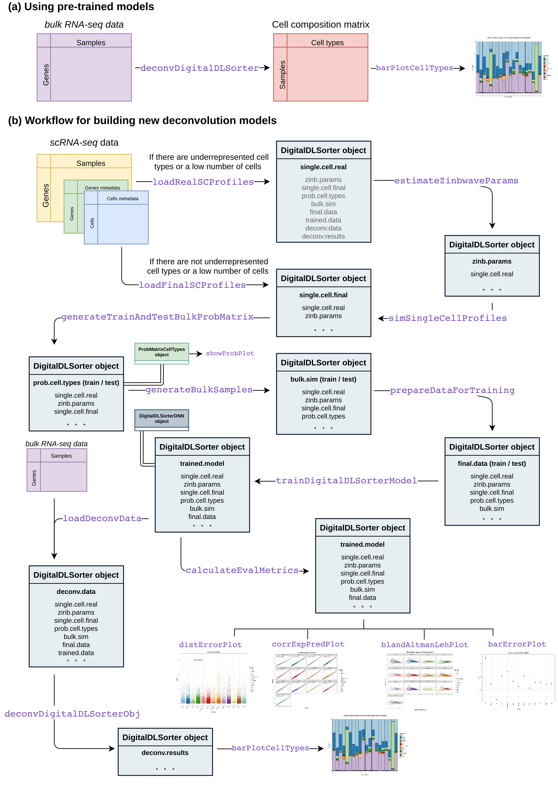

# _digitalDLSorteR_ R package (v0.1.0)

## Introduction

_digitalDLSorteR_ is an R package that implements a Deep Learning based method to enumerate and quantify the cell type composition presents in bulk RNA-seq samples. Our method makes use of Deep Neural Network (DNN) models to adjust any cell type composition starting from single-cell RNA-seq (scRNA-seq) data. For details about the method or the functionalities implemented in the package, see [Torroja and Sanchez-Cabo, 2019](https://www.frontiersin.org/articles/10.3389/fgene.2019.00978/full) and the vignette.

The rationale of the algorithm consists in a process that starts from scRNA-Seq data and, after a few steps, a Deep Neural Network (DNN) model is trained with simulated bulk RNA-seq samples whose cell composition is known. The trained model is able to deconvolute any bulk RNA-seq sample by determining the proportion of the different cell types considered by it. The main advantage that it presents is the possibility of building deconvolution models trained with real data which comes from certain biological environments. For example, for quantifying the proportion of tumor infiltrated lymphocytes (TILs) in breast cancer, by following this protocol you can obtain a specific model for this type of samples. This fact overcomes the limitation of other methods, since stromal and immune cells change significantly their profiles depending on the tissue and disease context.

The package can be used in two ways: for deconvoluting bulk RNA-seq samples using a pre-trained model provided by us or for building your own models trained from your own scRNA-seq samples. These new models may be published in order to make them available for other users that work with similar data (e.g. neural environment, prostate cancer environment, etc.). For the moment, the available models allows the deconvolution of TILs from breast cancer classified by our team. Breast cancer scRNA-seq data used comes from [GSE75688](https://www.ncbi.nlm.nih.gov/geo/query/acc.cgi?acc=GSE75688) ([Chung et al., 2017](https://www.nature.com/articles/ncomms15081)).

## Installation

_digitalDLSorteR_ only has been tested on Linux, so, for the moment, we recomend its installation only on linux distributions. This is a development version, so only it is possible its installation from GitHub by `devtools`.

```r
if (!requireNamespace("devtools", quietly = TRUE))
    install.packages("devtools")
devtools::install_github("diegommcc/digitalDLSorteR")
```

_digitalDLSorteR_ is based on DNN models. To do this, it uses [Keras](https://cloud.r-project.org/web/packages/keras/index.html) package available from CRAN, a high-level neural networks API implemented on Python. Keras R version works as interface between these two languages by using [reticulate](https://cran.r-project.org/web/packages/reticulate/index.html) package, so, during the installation, Keras requires a Python interpreter for working. We recommend the use of conda environments to provide a Python interpreter with all depencies covered. If you have a conda environment compatible with Keras requirements, the package will find it automatically. If not, Keras package will create a new environment named `r-reticulate` with all dependencies covered. There are other methods for installing a functionally back-end, see <https://keras.rstudio.com/reference/install_keras.html> for more details.

```r
install.packages("keras")
library(keras)
install_keras(method = "conda") # other options are available
```

This is the default CPU-based installation, but it is possible a more customized installation. See <https://tensorflow.rstudio.com/installation/> and <https://keras.rstudio.com/reference/install_keras.html>.

## Usage

You can see the provided vignette on this package. It explains a summary of the main functionallities of _digitalDLSorteR_ starting from its usage with pre-trained models that are integrated by default and concluding with the buildling of new deconvolution digitalDLSorter models. In any case, the following image shows the basic _digitalDLSorteR_ workflow


